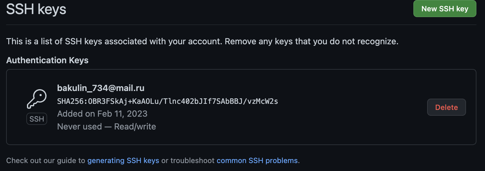
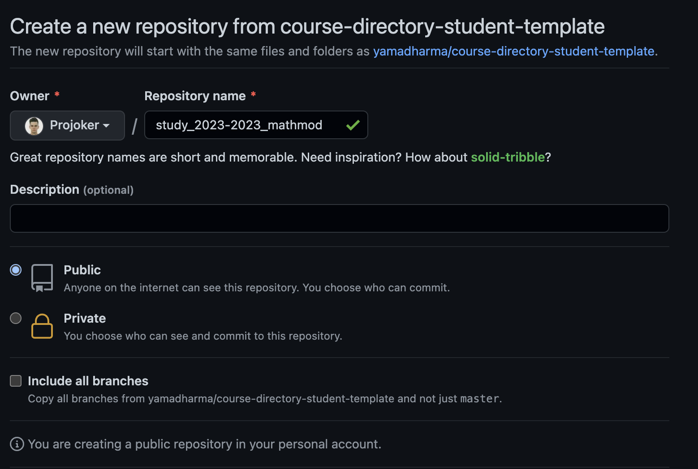
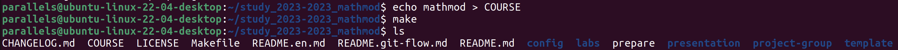
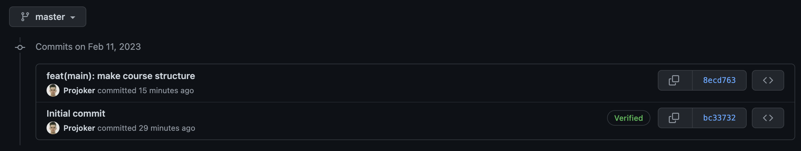
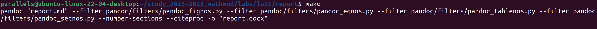

---
## Front matter
lang: ru-RU
title: Лабораторная работа № 1
subtitle: Git и Markdown
author:
  - Бакулин Н. А.
institute:
  - Российский университет дружбы народов, Москва, Россия
date: 11 февраля 2023

## i18n babel
babel-lang: russian
babel-otherlangs: english

## Formatting pdf
toc: false
toc-title: Содержание
slide_level: 2
aspectratio: 169
section-titles: true
theme: metropolis
header-includes:
 - \metroset{progressbar=frametitle,sectionpage=progressbar,numbering=fraction}
 - '\makeatletter'
 - '\beamer@ignorenonframefalse'
 - '\makeatother'
---

# Цель

- Организовать рабочего каталога по шаблону при помощи git и формирование отчёта в формате Markdown

# Выполнение работы

- Создали ssh ключ для доступа к github.

	{#fig:001 width=70%}
	
---

- Создали репозиторий на github используя шаблон.

	{#fig:002 width=70%}

---

- Склонировали репозиторий, указали название курса и сгенерировали структуру каталогов.

	{#fig:003 width=70%}

---

- Отправили изменения в репозиторий.

	{#fig:004 width=70%}

---

- Создали отчет и презентацию по 1 работе на Markdown, конвертировали в другие форматы при помощи Pandoc.

	{#fig:005 width=70%}

# Результаты

- Создали рабочий каталог для лабораторных работ
- Научились создавать отчеты на Markdown при помощи Pandoc
