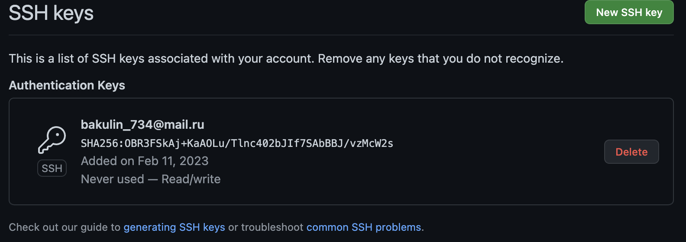
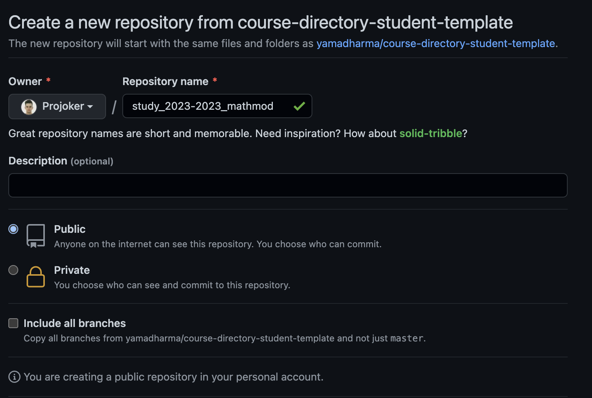
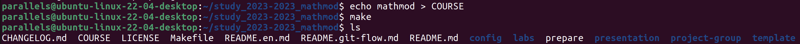
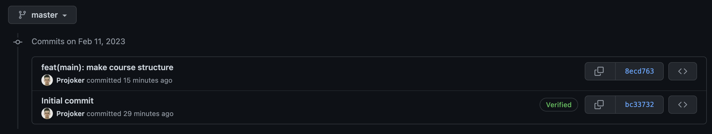
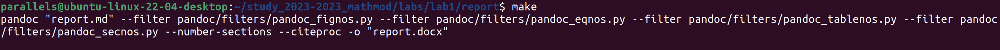

---
## Front matter
title: "Лабораторная работа № 1"
subtitle: "Git и Markdown"
author: "Никита Алексеевич Бакулин"

## Generic otions
lang: ru-RU
toc-title: "Содержание"

## Bibliography
bibliography: bib/cite.bib
csl: pandoc/csl/gost-r-7-0-5-2008-numeric.csl

## Pdf output format
toc: true # Table of contents
toc-depth: 2
lof: true # List of figures
lot: true # List of tables
fontsize: 12pt
linestretch: 1.5
papersize: a4
documentclass: scrreprt
## I18n polyglossia
polyglossia-lang:
  name: russian
  options:
	- spelling=modern
	- babelshorthands=true
polyglossia-otherlangs:
  name: english
## I18n babel
babel-lang: russian
babel-otherlangs: english
## Fonts
mainfont: PT Serif
romanfont: PT Serif
sansfont: PT Sans
monofont: PT Mono
mainfontoptions: Ligatures=TeX
romanfontoptions: Ligatures=TeX
sansfontoptions: Ligatures=TeX,Scale=MatchLowercase
monofontoptions: Scale=MatchLowercase,Scale=0.9
## Biblatex
biblatex: true
biblio-style: "gost-numeric"
biblatexoptions:
  - parentracker=true
  - backend=biber
  - hyperref=auto
  - language=auto
  - autolang=other*
  - citestyle=gost-numeric
## Pandoc-crossref LaTeX customization
figureTitle: "Рис."
tableTitle: "Таблица"
listingTitle: "Листинг"
lofTitle: "Список иллюстраций"
lotTitle: "Список таблиц"
lolTitle: "Листинги"
## Misc options
indent: true
header-includes:
  - \usepackage{indentfirst}
  - \usepackage{float} # keep figures where there are in the text
  - \floatplacement{figure}{H} # keep figures where there are in the text
---

# Цель работы

Познакомиться с Git и Markdown.

# Задание

  - Склонируйте шаблон рабочего каталога с github
  - Сделайте отчёт по лабораторной работе в формате Markdown

# Теоретическое введение

  Задать пользователя git:
 
  - git config --global user.name "Your Name"
  - git config --global user.email "your_email@whatever.com"

# Выполнение лабораторной работы

1. Создали ssh ключ для доступа к github (рис. {@fig:001}).

	{#fig:001 width=70%}

1. Создали репозиторий на github используя шаблон (рис. {@fig:002}).

	{#fig:002 width=70%}

1. Склонировали репозиторий, указали название курса и сгенерировали структуру каталогов (рис. {@fig:003}).

	{#fig:003 width=70%}

1. Отправили изменения в репозиторий (рис. {@fig:004}).

	{#fig:004 width=70%}

1. Создали отчет и презентацию по 1 работе на Markdown, конвертировали в другие форматы при помощи Pandoc (рис. {@fig:005}).

	{#fig:005 width=70%}

# Выводы

Успешно создали структуру рабочего каталога и сделали первый отчет.

# Список литературы{.unnumbered}

::: {#refs}
:::
