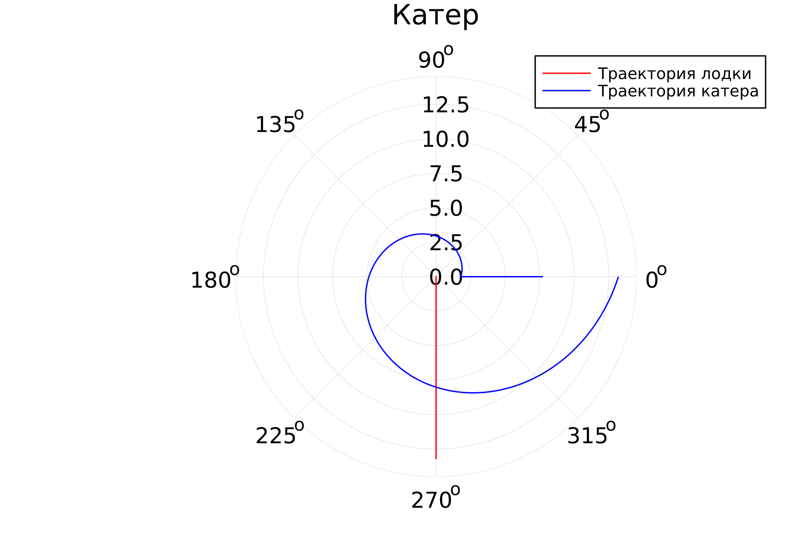

---
## Front matter
lang: ru-RU
title: Лабораторная работа № 2
subtitle: Задача о погоне
author:
  - Бакулин Н. А.
institute:
  - Российский университет дружбы народов, Москва, Россия
date: 18 февраля 2023

## i18n babel
babel-lang: russian
babel-otherlangs: english

## Formatting pdf
toc: false
toc-title: Содержание
slide_level: 2
aspectratio: 169
section-titles: true
theme: metropolis
header-includes:
 - \metroset{progressbar=frametitle,sectionpage=progressbar,numbering=fraction}
 - '\makeatletter'
 - '\beamer@ignorenonframefalse'
 - '\makeatother'
---

# Цель

- Приведем один из примеров построения математических моделей для выбора правильной стратегии при решении задач поиска. Например, рассмотрим задачу преследования браконьеров береговой охраной. На море в тумане катер береговой охраны преследует лодку браконьеров. Через определенный промежуток времени туман рассеивается, и лодка обнаруживается на расстоянии k км от катера. Затем лодка снова скрывается в тумане и уходит прямолинейно в неизвестном направлении. Известно, что скорость катера в 2 раза больше скорости браконьерской лодки. Необходимо определить по какой траектории необходимо двигаться катеру, чтоб нагнать лодку

# Выполнение работы

- Траектория катера должна быть такой, чтобы и катер, и лодка все время были на одном расстоянии от полюса, только в этом случае траектория катера пересечется с траекторией лодки. Поэтому для начала катер береговой охраны должен двигаться некоторое время прямолинейно, пока не окажется на том же расстоянии от полюса, что и лодка браконьеров. После этого катер береговой охраны должен двигаться вокруг полюса удаляясь от него с той же скоростью, что и лодка браконьеров.

	t = r0 / Vл = (a - r0) / Vк = (a - r0) / 3,3Vл 

	r0 = a / 4,3
	
---

- После того, как катер береговой охраны окажется на одном расстоянии от полюса, что и лодка, он должен сменить прямолинейную траекторию и начать двигаться вокруг полюса удаляясь от него со скоростью лодки v. Для этого скорость катера раскладываем на две составляющие: vr - радиальная скорость и vt - тангенциальная скорость

	Vк^2 = Vr^2 + Vt^2

	dr = r*dO / sqrt(9,89)

	r = a / 4,3 * e ^ (O / sqrt(9,89))

---

- Написание программы на Julia

	{#fig:001 width=70%}

# Результаты

- Пересекаются при O = 270, r = 8
- Успешно решили задачу о погоне, смоделировали траекторию.
