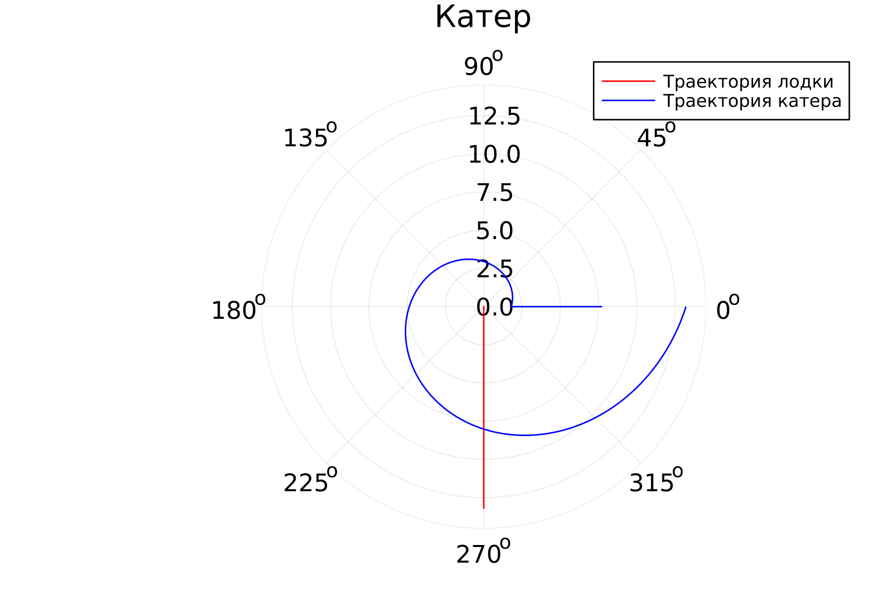

---
## Front matter
title: "Лабораторная работа № 2"
subtitle: "Задача о погоне"
author: "Никита Алексеевич Бакулин"

## Generic otions
lang: ru-RU
toc-title: "Содержание"

## Bibliography
bibliography: bib/cite.bib
csl: pandoc/csl/gost-r-7-0-5-2008-numeric.csl

## Pdf output format
toc: true # Table of contents
toc-depth: 2
lof: true # List of figures
lot: true # List of tables
fontsize: 12pt
linestretch: 1.5
papersize: a4
documentclass: scrreprt
## I18n polyglossia
polyglossia-lang:
  name: russian
  options:
	- spelling=modern
	- babelshorthands=true
polyglossia-otherlangs:
  name: english
## I18n babel
babel-lang: russian
babel-otherlangs: english
## Fonts
mainfont: PT Serif
romanfont: PT Serif
sansfont: PT Sans
monofont: PT Mono
mainfontoptions: Ligatures=TeX
romanfontoptions: Ligatures=TeX
sansfontoptions: Ligatures=TeX,Scale=MatchLowercase
monofontoptions: Scale=MatchLowercase,Scale=0.9
## Biblatex
biblatex: true
biblio-style: "gost-numeric"
biblatexoptions:
  - parentracker=true
  - backend=biber
  - hyperref=auto
  - language=auto
  - autolang=other*
  - citestyle=gost-numeric
## Pandoc-crossref LaTeX customization
figureTitle: "Рис."
tableTitle: "Таблица"
listingTitle: "Листинг"
lofTitle: "Список иллюстраций"
lotTitle: "Список таблиц"
lolTitle: "Листинги"
## Misc options
indent: true
header-includes:
  - \usepackage{indentfirst}
  - \usepackage{float} # keep figures where there are in the text
  - \floatplacement{figure}{H} # keep figures where there are in the text
---

# Цель работы

Приведем один из примеров построения математических моделей для выбора правильной стратегии при решении задач поиска. Например, рассмотрим задачу преследования браконьеров береговой охраной. На море в тумане катер береговой охраны преследует лодку браконьеров. Через определенный промежуток времени туман рассеивается, и лодка обнаруживается на расстоянии k км от катера. Затем лодка снова скрывается в тумане и уходит прямолинейно в неизвестном направлении. Известно, что скорость катера в 2 раза больше скорости браконьерской лодки. Необходимо определить по какой траектории необходимо двигаться катеру, чтоб нагнать лодку

# Задание

  1. Запишите уравнение, описывающее движение катера, с начальными условиями для двух случаев (в зависимости от расположения катера относительно лодки в начальный момент времени).
  1. Постройте траекторию движения катера и лодки для двух случаев.
  1. Найдите точку пересечения траектории катера и лодки

# Теоретическое введение

  На море в тумане катер береговой охраны преследует лодку браконьеров. Через определенный промежуток времени туман рассеивается, и лодка обнаруживается на расстоянии 7,7 км от катера. Затем лодка снова скрывается в тумане и уходит прямолинейно в неизвестном направлении. Известно, что скорость катера в 3,3 раза больше скорости браконьерской лодки.

# Выполнение лабораторной работы

1. Поиск зависимости радиуса катера от угла
	
	a = 7,7
	
	Vк = 3,3Vл

	Траектория катера должна быть такой, чтобы и катер, и лодка все время были на одном расстоянии от полюса, только в этом случае траектория катера пересечется с траекторией лодки. Поэтому для начала катер береговой охраны должен двигаться некоторое время прямолинейно, пока не окажется на том же расстоянии от полюса, что и лодка браконьеров. После этого катер береговой охраны должен двигаться вокруг полюса удаляясь от него с той же скоростью, что и лодка браконьеров.

	t = r0 / Vл = (a - r0) / Vк = (a - r0) / 3,3Vл
	
	r0 = (a - r0) / 3,3
	
	3,3r0 = a - r0
	
	4,3r0 = a
	
	r0 = a / 4,3
	
	r0 = 7,7 / 4,3 = 1,8

	После того, как катер береговой охраны окажется на одном расстоянии от полюса, что и лодка, он должен сменить прямолинейную траекторию и начать двигаться вокруг полюса удаляясь от него со скоростью лодки v. Для этого скорость катера раскладываем на две составляющие: vr - радиальная скорость и vt - тангенциальная скорость

	Vк^2 = Vr^2 + Vt^2

	Vr = Vл

	(3,3Vл)^2 = Vл^2 + Vt^2

	Vt = sqrt(10,89Vл^2 - Vл^2) = sqrt(9,89)Vл

	Vr = dr/dt = Vл

	Vt = r*dO/dt = sqrt(9,89)Vл

	Vл * dt = dr

	Vл * dt = r*dO / sqrt(9,89)

	Решим дифференциальное уравнение с разделяющимися переменными

	dr = r*dO / sqrt(9,89)

	dr / r = dO / sqrt(9,89)

	∫ dr / r = ∫ dO / sqrt(9,89)

	ln(r) = O / sqrt(9,89) + C

	e^ln(r) = e ^ (O / sqrt(9,89) + C)

	r^ln(e) =  e ^ (O / sqrt(9,89)) * e^C

	r = e ^ (O / sqrt(9,89)) * e^C (e^C = C)

	r = C * e ^ (O / sqrt(9,89))

	Найдем значение константы при начальном условии

	r(0) = C * e ^ (0 / sqrt(9,89)) = C = a / 4,3

	Уравнение радиуса лодки от угла
	r = a / 4,3 * e ^ (O / sqrt(9,89))
  
2. Написание программы на Julia [@julia]

	~~~~~~~
	using Plots

	a = 7.7
	r0 = a / 4.3

	# радиусы катера при движении к центру
	rk_straight = collect(a:-0.01:r0)
	# углы катера при движении к центру
	Ok_straight = fill(1e-10, length(rk_straight))
	# уравнение радиуса катера при движении по спирали
	fk(O) = r0 * e ^ (O / √9.89)
	# углы катера при движении по спирали
	Ok_spiral = collect(0:0.01:2π)
	# радиусы катера при движении по спирали
	rk_spiral = fk.(Ok_spiral)
	# углы катера
	Ok = append!(Ok_straight, Ok_spiral)
	# радиусы катера
	rk = append!(rk_straight, rk_spiral)

	# радиусы лодки
	rl = append!(collect(0:0.01:r0), rk_spiral)
	# углы лодки
	Ol = fill(1.5*π, length(rl))

	plt = plot(
	  proj = :polar,
	  aspect_ratio=:equal,
	  dpi=300,
	  legend=true)

	plot!(
	  plt,
	  Ol,
	  rl,
	  xlabel="O",
	  ylabel="r(O)",
	  label="Траектория лодки",
	  color=:red,
	  title="Лодка")

	plot!(
	  plt,
	  Ok,
	  rk,
	  xlabel="O",
	  ylabel="r(O)",
	  label="Траектория катера",
	  color=:blue,
	  title="Катер")

	savefig(plt, "solution.png")
	~~~~~~~

	{#fig:001 width=70%}

# Выводы

Успешно решили задачу о погоне, смоделировали траекторию. Пересекаются при O = 270, r = 8

# Список литературы{.unnumbered}

::: {#refs}
:::
