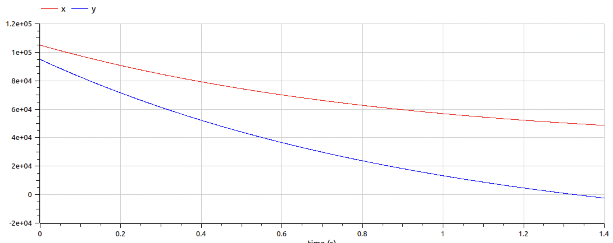
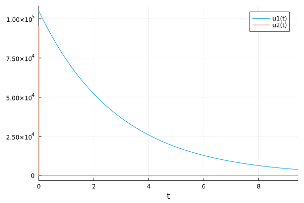
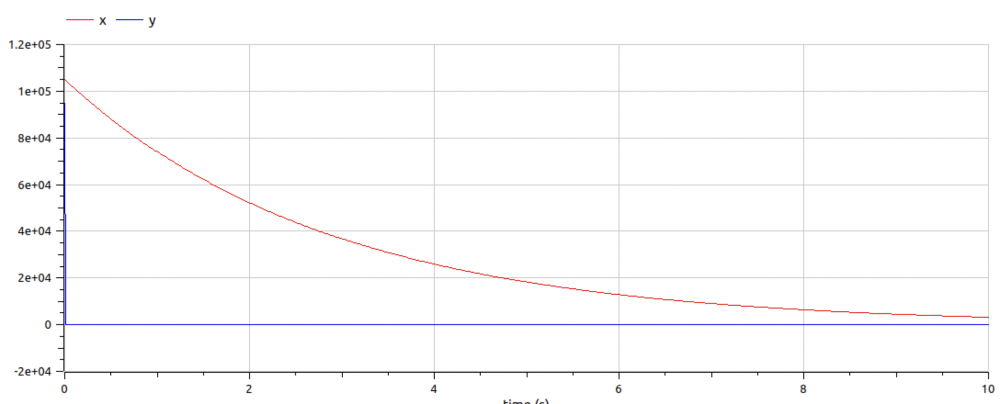

---
## Front matter
lang: ru-RU
title: Лабораторная работа № 3
subtitle: Модель боевых действий
author:
  - Бакулин Н. А.
institute:
  - Российский университет дружбы народов, Москва, Россия
date: 25 февраля 2023

## i18n babel
babel-lang: russian
babel-otherlangs: english

## Formatting pdf
toc: false
toc-title: Содержание
slide_level: 2
aspectratio: 169
section-titles: true
theme: metropolis
header-includes:
 - \metroset{progressbar=frametitle,sectionpage=progressbar,numbering=fraction}
 - '\makeatletter'
 - '\beamer@ignorenonframefalse'
 - '\makeatother'
---

# Цель

- Рассмотрим некоторые простейшие модели боевых действий – модели Ланчестера. В противоборстве могут принимать участие как регулярные войска, так и партизанские отряды. В общем случае главной характеристикой соперников являются численности сторон. Если в какой-то момент времени одна из численностей обращается в нуль, то данная сторона считается проигравшей (при условии, что численность другой стороны в данный момент положительна)

# Выполнение работы

  1. Модель боевых действий между регулярными войсками (уравнение [1]):
    $$
    \begin{cases}
      \frac{dx}{dt}=-0.35x(t)-0.45y(t)+2\sin(t)
      \\
      \frac{dy}{dt}=-0.69x(t)-0.61y(t)+\cos(t)+1
    \end{cases}
    $$ (1)

---

  Написание программы на Julia (рис. [1]) и OpenModelica (рис. [2])
    
  {#fig:01 width=30%}
    
  {#fig:02 width=50%}

---

  1. Модель ведение боевых действий с участием регулярных войск и партизанских отрядов (уравнение [2]):
    $$
    \begin{cases}
      \frac{dx}{dt}=-0.35x(t)-0.73y(t)+2\sin(2t)
      \\
      \frac{dy}{dt}=-0.45x(t)y(t)-0.41y(t)+\cos(t)+1
    \end{cases}
    $$ (2)

---

  Написание программы на Julia (рис. [3]) и OpenModelica (рис. [4])
    
  {#fig:03 width=30%}
  
  {#fig:04 width=50%}

# Результаты

- Успешно рассчитали модель боевых действий
