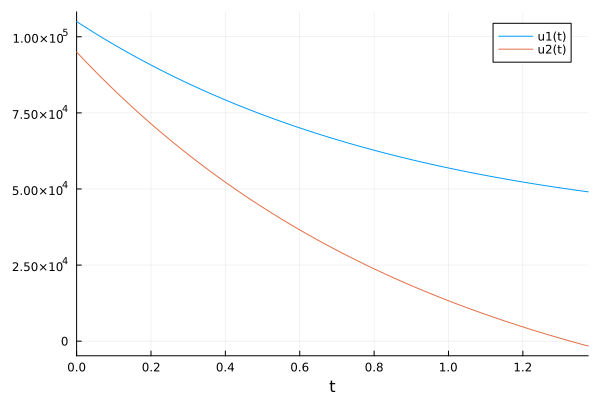
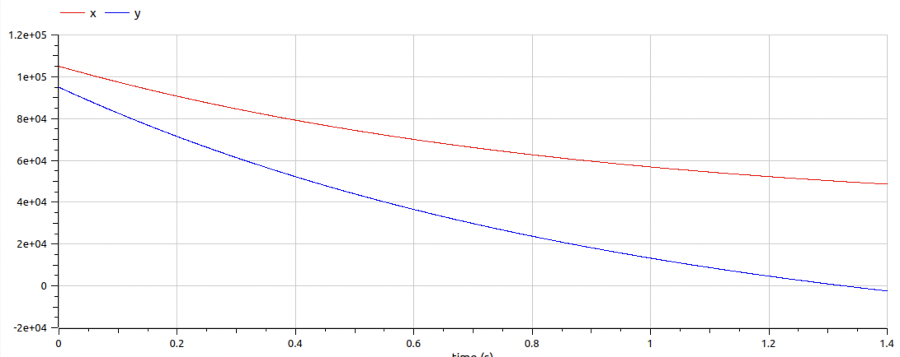
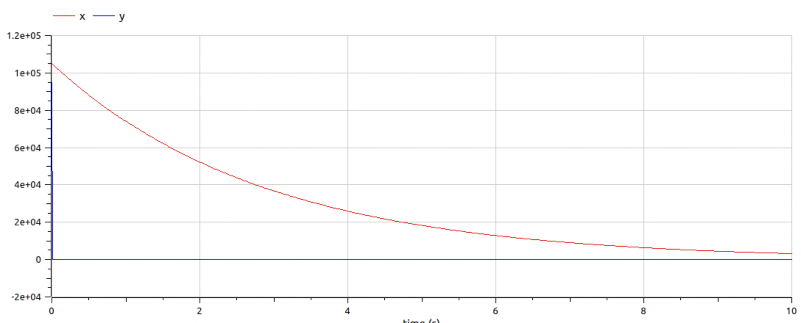

---
## Front matter
title: "Лабораторная работа № 3"
subtitle: "Модель боевых действий"
author: "Никита Алексеевич Бакулин"

## Generic otions
lang: ru-RU
toc-title: "Содержание"

## Bibliography
bibliography: bib/cite.bib
csl: pandoc/csl/gost-r-7-0-5-2008-numeric.csl

## Pdf output format
toc: true # Table of contents
toc-depth: 2
lof: true # List of figures
lot: true # List of tables
fontsize: 12pt
linestretch: 1.5
papersize: a4
documentclass: scrreprt
## I18n polyglossia
polyglossia-lang:
  name: russian
  options:
	- spelling=modern
	- babelshorthands=true
polyglossia-otherlangs:
  name: english
## I18n babel
babel-lang: russian
babel-otherlangs: english
## Fonts
mainfont: PT Serif
romanfont: PT Serif
sansfont: PT Sans
monofont: PT Mono
mainfontoptions: Ligatures=TeX
romanfontoptions: Ligatures=TeX
sansfontoptions: Ligatures=TeX,Scale=MatchLowercase
monofontoptions: Scale=MatchLowercase,Scale=0.9
## Biblatex
biblatex: true
biblio-style: "gost-numeric"
biblatexoptions:
  - parentracker=true
  - backend=biber
  - hyperref=auto
  - language=auto
  - autolang=other*
  - citestyle=gost-numeric
## Pandoc-crossref LaTeX customization
figureTitle: "Рис."
tableTitle: "Таблица"
listingTitle: "Листинг"
lofTitle: "Список иллюстраций"
lotTitle: "Список таблиц"
lolTitle: "Листинги"
## Misc options
indent: true
header-includes:
  - \usepackage{indentfirst}
  - \usepackage{float} # keep figures where there are in the text
  - \floatplacement{figure}{H} # keep figures where there are in the text
---

# Цель работы

  Рассмотрим некоторые простейшие модели боевых действий – модели Ланчестера. В противоборстве могут принимать участие как регулярные войска, так и партизанские отряды. В общем случае главной характеристикой соперников являются численности сторон. Если в какой-то момент времени одна из численностей обращается в нуль, то данная сторона считается проигравшей (при условии, что численность другой стороны в данный момент положительна)

# Задание

  Постройте графики изменения численности войск армии Х и армии У для
следующих случаев
  
  1. Модель боевых действий между регулярными войсками (уравнение [-@eq:01]):
    $$
    \begin{cases}
      \frac{dx}{dt}=-0.35x(t)-0.45y(t)+2\sin(t)
      \\
      \frac{dy}{dt}=-0.69x(t)-0.61y(t)+\cos(t)+1
    \end{cases}
    $$ {#eq:01}
  1. Модель ведение боевых действий с участием регулярных войск и партизанских отрядов (уравнение [-@eq:02]):  
    $$
    \begin{cases}
      \frac{dx}{dt}=-0.35x(t)-0.73y(t)+2\sin(2t)
      \\
      \frac{dy}{dt}=-0.45x(t)y(t)-0.41y(t)+\cos(t)+1
    \end{cases}
    $$ {#eq:02}

# Теоретическое введение

Между страной Х и страной У идет война. Численность состава войск исчисляется от начала войны, и являются временными функциями x(t) и y(t). В начальный момент времени страна Х имеет армию численностью 105 000 человек, а в распоряжении страны У армия численностью в 95 000 человек. Для упрощения модели считаем, что коэффициенты a, b, c, h постоянны. Также считаем P(t) и Q(t) непрерывные функции.
  
  Модель боевых действий между регулярными войсками описывается следующим образом (уравнение [-@eq:03]):
  $$
  \begin{cases}
    \frac{dx}{dt}=-a(t)x(t)-b(t)y(t)+R(t)
    \\
    \frac{dy}{dt}=-c(t)x(t)-h(t)y(t)+Q(t)
  \end{cases}
  $$ {#eq:03}

# Выполнение лабораторной работы

1. Написание программы на Julia [@julia]

  ~~~~~~~
  using Plots
  using DifferentialEquations

  x0 = 105000
  y0 = 95000

  a = 0.35
  b = 0.45
  c = 0.69
  h = 0.61
  P1(t) = 2*sin(t)
  Q1(t) = cos(t)+1

  function F1(du, u, p, t)
   du[1] = -a*u[1] - b*u[2] + P1(t)
   du[2] = -c*u[1] - h*u[2] + Q1(t)
  end

  prob = ODEProblem(F1, [x0;y0], (0,10))
  condition(u,t,integrator) = u[1] >= 0 && u[2] >= 0
  cb = ContinuousCallback(condition,terminate!)
  sol = solve(prob,callback=cb)

  plt1 = plot(legend=true)
  plot!(plt1, sol)
  savefig(plt1, "solution1.png")

  a = 0.35
  b = 0.73
  c = 0.45
  h = 0.41
  P2(t) = 2*sin(2*t)
  Q2(t) = cos(t)+1

  function F2(du, u, p, t)
   du[1] = -a*u[1] - b*u[2] + P2(t)
   du[2] = -c*u[1]*u[2] - h*u[2] + Q2(t)
  end

  prob2 = ODEProblem(F2, [x0;y0], (0,10))
  sol2 = solve(prob2,callback=cb)

  plt2 = plot(legend=true)
  plot!(plt2, sol2)
  savefig(plt2, "solution2.png")
  ~~~~~~~
  
  График для первого случая представлен на рис. [@fig:01], для второго на рис. [@fig:02]

  {#fig:01 width=70%}
  
  {#fig:02 width=70%}
  
2. Написание программы на OpenModelica [@openmodelica]

  ~~~~~~~
  model Battle1
    parameter Integer x0 = 105000;
    parameter Integer y0 = 95000;

    parameter Real a = 0.35;
    parameter Real b = 0.45;
    parameter Real c = 0.69;
    parameter Real h = 0.61;
  
    Real P;
    Real Q;
  
    Real x(start=x0);
    Real y(start=y0);
  
    equation
  
    P = 2*sin(time);
    Q = cos(time)+1;
  
    der(x) = - a * x - b * y + P;
    der(y) = - c * x - h * y + Q;
  end Battle1;
  ~~~~~~~
  ~~~~~~~
  model Battle2
    parameter Integer x0 = 105000;
    parameter Integer y0 = 95000;

    parameter Real a = 0.35;
    parameter Real b = 0.73;
    parameter Real c = 0.45;
    parameter Real h = 0.41;
  
    Real P;
    Real Q;
  
    Real x(start=x0);
    Real y(start=y0);
  
    equation
  
    P = 2*sin(2*time);
    Q = cos(time)+1;
  
    der(x) = - a * x - b * y + P;
    der(y) = - c * x * y - h * y + Q;
  end Battle2;
  ~~~~~~~
  
  График для первого случая представлен на рис. [@fig:03], для второго на рис. [@fig:04]

  {#fig:03 width=70%}

  {#fig:04 width=70%}

# Выводы

Успешно рассчитали модель боевых действий

# Список литературы{.unnumbered}

::: {#refs}
:::
