---
## Front matter
lang: ru-RU
title: Лабораторная работа № 4
subtitle: Модель гармонических колебаний
author:
  - Бакулин Н. А.
institute:
  - Российский университет дружбы народов, Москва, Россия
date: 4 марта 2023

## i18n babel
babel-lang: russian
babel-otherlangs: english

## Formatting pdf
toc: false
toc-title: Содержание
slide_level: 2
aspectratio: 169
section-titles: true
theme: metropolis
header-includes:
 - \metroset{progressbar=frametitle,sectionpage=progressbar,numbering=fraction}
 - '\makeatletter'
 - '\beamer@ignorenonframefalse'
 - '\makeatother'
---

# Цель

- Научиться создавать модель линейного гармонического осциллятора, так как движение грузика на пружинке, маятника, заряда в электрическом контуре, а также эволюция во времени многих систем в физике, химии, биологии и других науках при определенных предположениях можно описать одним и тем же дифференциальным уравнением, которое в теории колебаний выступает в качестве основной модели.

# Выполнение работы
1. Решить:
    1. Колебания гармонического осциллятора без затуханий и без действий внешней силы x'' + 13x = 0   
    1. Колебания гармонического осциллятора c затуханием и без действий внешней силы x'' + 7x' + x = 0
    1. Колебания гармонического осциллятора c затуханием и под действием внешней силы x'' + x' + 30x = sin(0.6t)

1. Уравнения в общем виде:
  $$
  \ddot x(t) + a\dot x(t) + bx(t) = F(t)
  $$
    
1. Приведенное уравнение [1] к системе:
  $$
  \begin{cases}
    \frac{dx}{dt}=y
    \\
    \frac{dy}{dt}=F(t)-ay-bx
  \end{cases}
  $$
    
---

Написание программы на Julia (рис. [1]) и (рис. [2]) для решения x'' + 13x = 0
    
  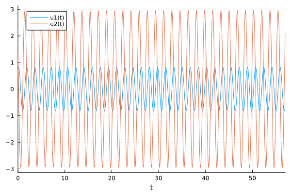{#fig:01 width=30%}
    
  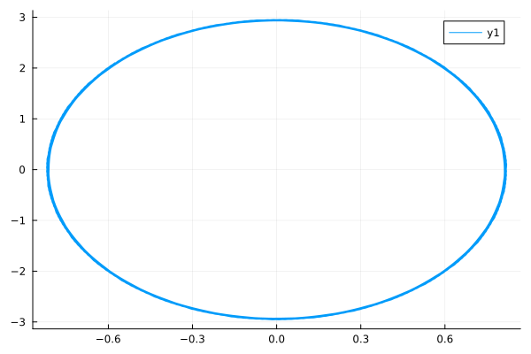{#fig:02 width=30%}

---

Написание программы на OpenModelica (рис. [3]) и (рис. [4]) для решения x'' + 13x = 0
    
  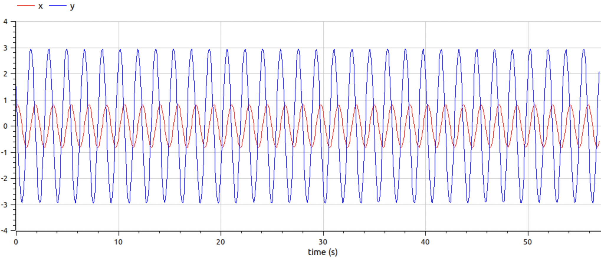{#fig:03 width=30%}
    
  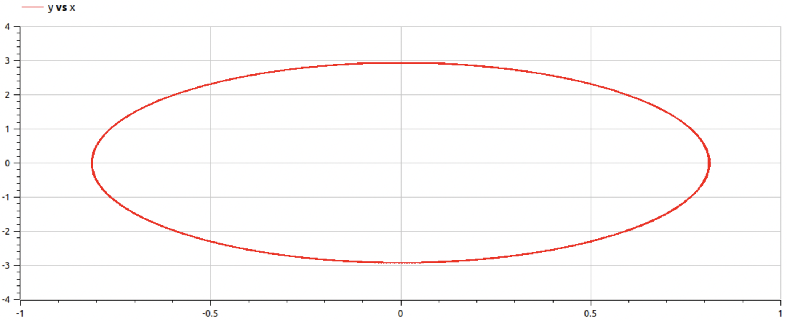{#fig:04 width=30%}

---

Написание программы на Julia (рис. [5]) и (рис. [6]) для решения x'' + 7x' + x = 0
    
  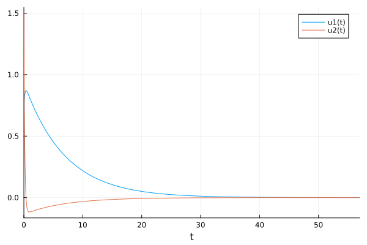{#fig:05 width=30%}
    
  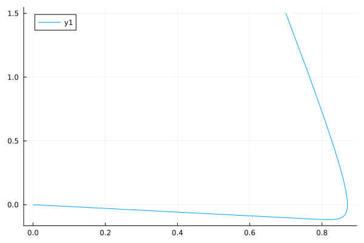{#fig:06 width=30%}

---

Написание программы на OpenModelica (рис. [7]) и (рис. [8]) для решения x'' + 7x' + x = 0
    
  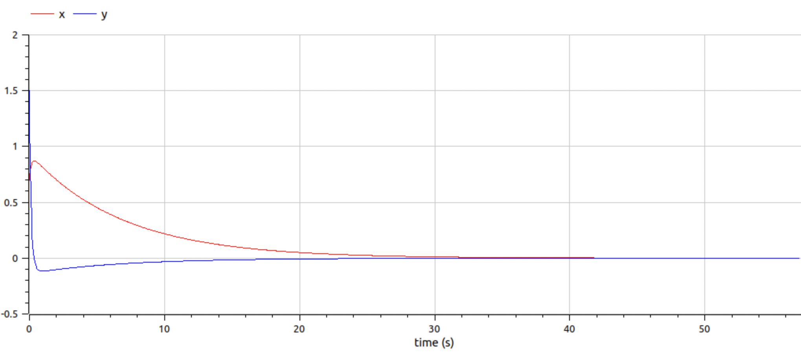{#fig:07 width=30%}
    
  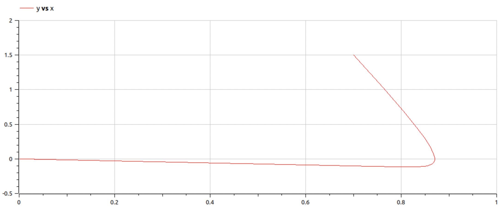{#fig:08 width=30%}

---

Написание программы на Julia (рис. [9]) и (рис. [10]) для решения x'' + x' + 30x = sin(0.6t)
    
  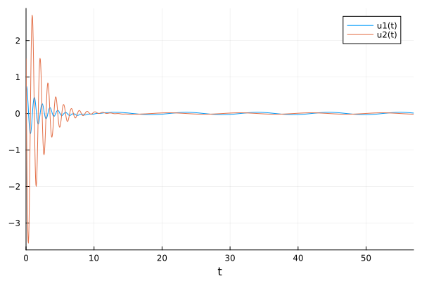{#fig:09 width=30%}
    
  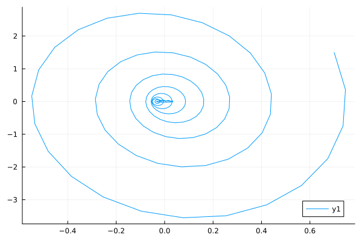{#fig:10 width=30%}

---

Написание программы на OpenModelica (рис. [11]) и (рис. [12]) для решения x'' + x' + 30x = sin(0.6t)
    
  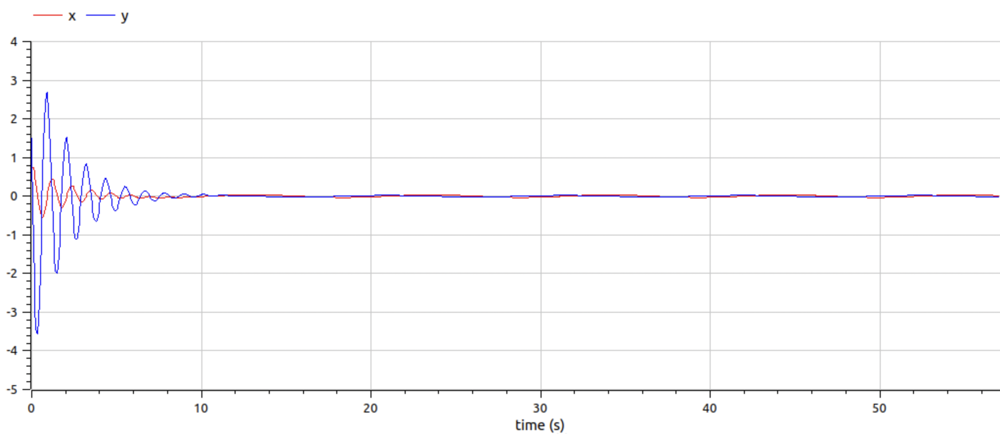{#fig:11 width=30%}
    
  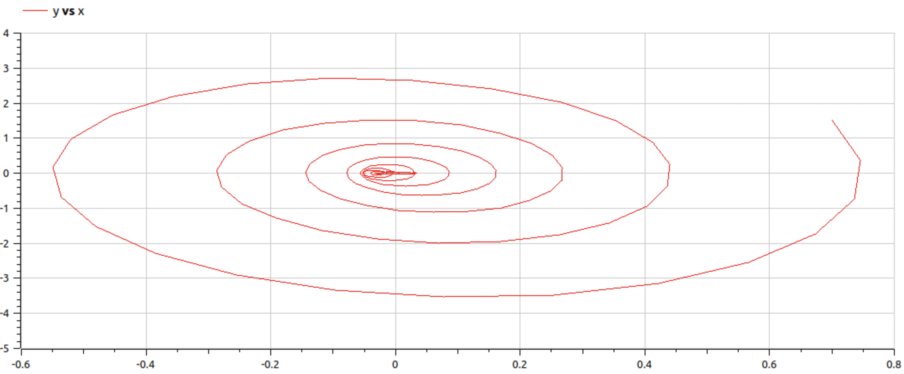{#fig:12 width=30%}

# Результаты

- Успешно рассчитали модель гармонических колебаний
