---
## Front matter
title: "Лабораторная работа № 4"
subtitle: "Модель гармонических колебаний"
author: "Никита Алексеевич Бакулин"

## Generic otions
lang: ru-RU
toc-title: "Содержание"

## Bibliography
bibliography: bib/cite.bib
csl: pandoc/csl/gost-r-7-0-5-2008-numeric.csl

## Pdf output format
toc: true # Table of contents
toc-depth: 2
lof: true # List of figures
lot: true # List of tables
fontsize: 12pt
linestretch: 1.5
papersize: a4
documentclass: scrreprt
## I18n polyglossia
polyglossia-lang:
  name: russian
  options:
	- spelling=modern
	- babelshorthands=true
polyglossia-otherlangs:
  name: english
## I18n babel
babel-lang: russian
babel-otherlangs: english
## Fonts
mainfont: PT Serif
romanfont: PT Serif
sansfont: PT Sans
monofont: PT Mono
mainfontoptions: Ligatures=TeX
romanfontoptions: Ligatures=TeX
sansfontoptions: Ligatures=TeX,Scale=MatchLowercase
monofontoptions: Scale=MatchLowercase,Scale=0.9
## Biblatex
biblatex: true
biblio-style: "gost-numeric"
biblatexoptions:
  - parentracker=true
  - backend=biber
  - hyperref=auto
  - language=auto
  - autolang=other*
  - citestyle=gost-numeric
## Pandoc-crossref LaTeX customization
figureTitle: "Рис."
tableTitle: "Таблица"
listingTitle: "Листинг"
lofTitle: "Список иллюстраций"
lotTitle: "Список таблиц"
lolTitle: "Листинги"
## Misc options
indent: true
header-includes:
  - \usepackage{indentfirst}
  - \usepackage{float} # keep figures where there are in the text
  - \floatplacement{figure}{H} # keep figures where there are in the text
---

# Цель работы

  Научиться создавать модель линейного гармонического осциллятора, так как движение грузика на пружинке, маятника, заряда в электрическом контуре, а также эволюция во времени многих систем в физике, химии, биологии и других науках при определенных предположениях можно описать одним и тем же дифференциальным уравнением, которое в теории колебаний выступает в качестве основной модели.

# Задание

  Постройте фазовый портрет гармонического осциллятора и решение уравнения гармонического осциллятора для следующих случаев
  
  1. Колебания гармонического осциллятора без затуханий и без действий внешней силы x'' + 13x = 0
  1. Колебания гармонического осциллятора c затуханием и без действий внешней силы x'' + 7x' + x = 0
  1. Колебания гармонического осциллятора c затуханием и под действием внешней силы x'' + x' + 30x = sin(0.6t)

# Теоретическое введение

Уравнение свободных колебаний гармонического осциллятора имеет следующий вид:
  $$
  \ddot x+2\gamma\dot x+\omega^2_0x=0
  $$ {#eq:01}
где x – переменная, описывающая состояние системы (смещение грузика, заряд конденсатора и т.д.), $\gamma$ – параметр, характеризующий потери энергии (трение в механической системе, сопротивление в контуре), $\omega_0$ – собственная частота колебаний, $t$ – время. (Обозначения $\ddot x = \frac{d^2x}{dt^2}$, $\dot x = \frac{dx}{dt}$).

Уравнение [-@eq:01] есть линейное однородное дифференциальное уравнение второго порядка и оно является примером линейной динамической системы.

# Выполнение лабораторной работы

1. Запишем наши уравнения в общем виде:
  $$
  \ddot x(t) + a\dot x(t) + bx(t) = F(t)
  $$ {#eq:02}
  
  Сведем уравнение [-@eq:02] к системе:
  $$
  \begin{cases}
    \frac{dx}{dt} = y
    \\
    \frac{dy}{dt} = F(t) -ay - bx
  \end{cases}
  $$ {#eq:03}

2. Написание программы на Julia [@julia]

  ~~~~~~~
  using Plots
  using DifferentialEquations

  x0 = 0.7
  y0 = 1.5

  tspan = (0,57)

  function F(du, u, p, t)
   du[1] = u[2]
   du[2] = f(t)-a*u[2]-b*u[1]
  end

  a = 0
  b = 13
  f(t) = 0

  prob = ODEProblem(F, [x0;y0], tspan)
  sol = solve(prob, saveat=0.05)
  X = Float64[]
  Y = Float64[]
  for u in sol.u
	  x, y = u
	  push!(X,x)
	  push!(Y,y)
  end

  plt = plot(legend=true)
  plot!(plt, sol)
  savefig(plt, "solution1.png")
  plt = plot(legend=true)
  plot!(plt, X, Y)
  savefig(plt, "solution1_phase.png")

  a = 7
  b = 1
  f(t) = 0

  prob = ODEProblem(F, [x0;y0], tspan)
  sol = solve(prob, saveat=0.05)
  X = Float64[]
  Y = Float64[]
  for u in sol.u
	  x, y = u
	  push!(X,x)
	  push!(Y,y)
  end

  plt = plot(legend=true)
  plot!(plt, sol)
  savefig(plt, "solution2.png")
  plt = plot(legend=true)
  plot!(plt, X, Y)
  savefig(plt, "solution2_phase.png")

  a = 1
  b = 30
  f(t) = sin(0.6 * t)

  prob = ODEProblem(F, [x0;y0], tspan)
  sol = solve(prob, saveat=0.05)
  X = Float64[]
  Y = Float64[]
  for u in sol.u
	  x, y = u
	  push!(X,x)
	  push!(Y,y)
  end

  plt = plot(legend=true)
  plot!(plt, sol)
  savefig(plt, "solution3.png")
  plt = plot(legend=true)
  plot!(plt, X, Y)
  savefig(plt, "solution3_phase.png")
  ~~~~~~~
  
  Графики решения и фазового портрета для первого случая представлен на рис. [@fig:01] и рис. [@fig:02], для второго на рис. [@fig:03] и рис. [@fig:04], для третьего на рис. [@fig:05] и рис. [@fig:06]

  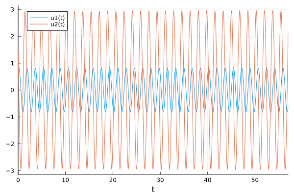{#fig:01 width=70%}
  
  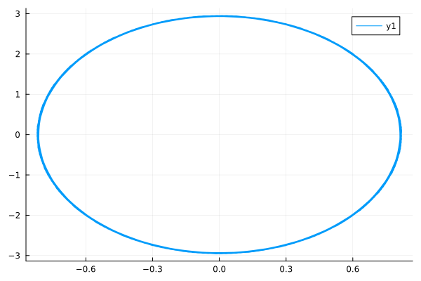{#fig:02 width=70%}
  
  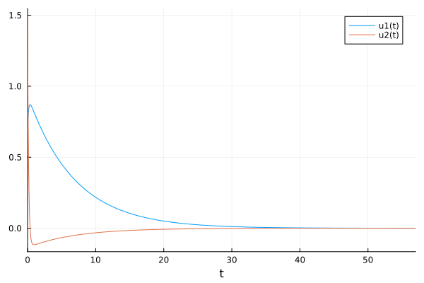{#fig:03 width=70%}
  
  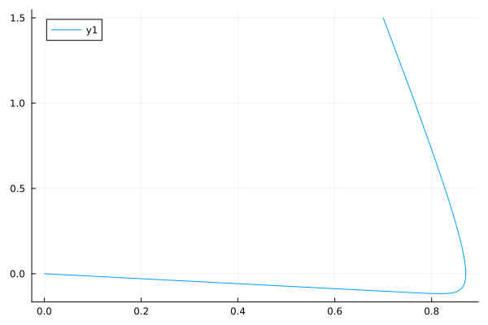{#fig:04 width=70%}
  
  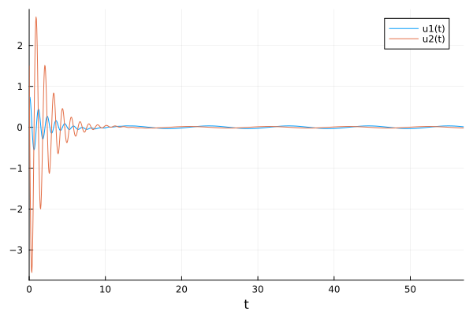{#fig:05 width=70%}
  
  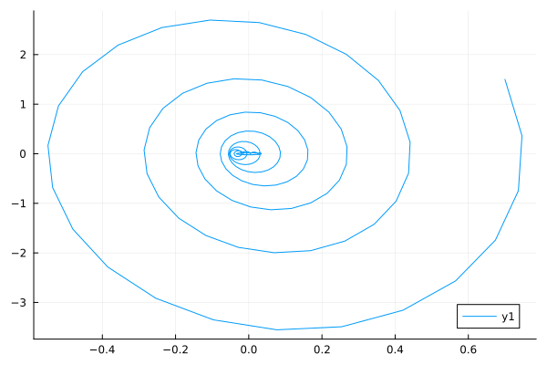{#fig:06 width=70%}
  
3. Написание программы на OpenModelica [@openmodelica]

  ~~~~~~~
  model lab4_1
    Real x(start=0.7);
    Real y(start=1.5);
  
    parameter Real a = 0.0;
    parameter Real b = 13.0;
  equation
    der(x) = y;
    der(y) = -a*y-b*x;
  end lab4_1;
  ~~~~~~~
  ~~~~~~~
  model lab4_2
    Real x(start=0.7);
    Real y(start=1.5);
  
    parameter Real a = 7.0;
    parameter Real b = 1.0;
  equation
    der(x) = y;
    der(y) = -a*y-b*x;
  end lab4_2;
  ~~~~~~~
  ~~~~~~~
  model lab4_3
    Real x(start=0.7);
    Real y(start=1.5);
  
    parameter Real a = 1.0;
    parameter Real b = 30.0;
  equation
    der(x) = y;
    der(y) = sin(0.6*time)-a*y-b*x;
  end lab4_3;
  ~~~~~~~
  
  График решения и фазового портрета для первого случая представлен на рис. [@fig:07] и рис. [@fig:08], для второго на рис. [@fig:09] и рис. [@fig:10], для третьего на рис. [@fig:11] и рис. [@fig:12]

  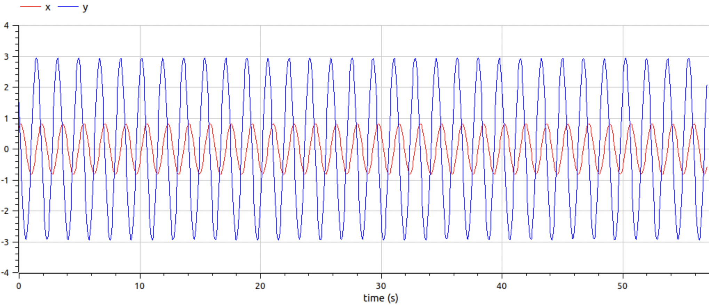{#fig:07 width=70%}

  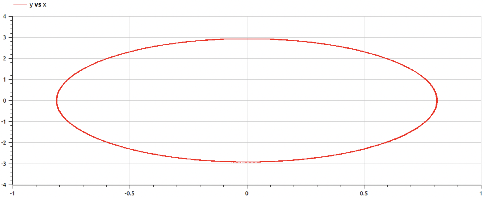{#fig:08 width=70%}

  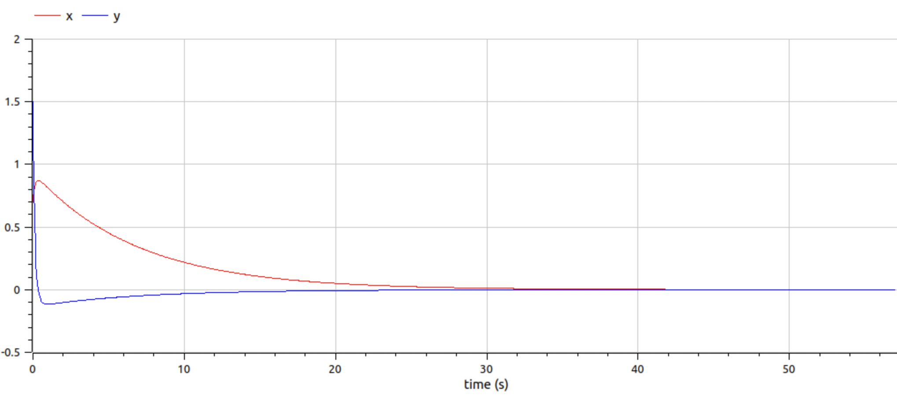{#fig:09 width=70%}

  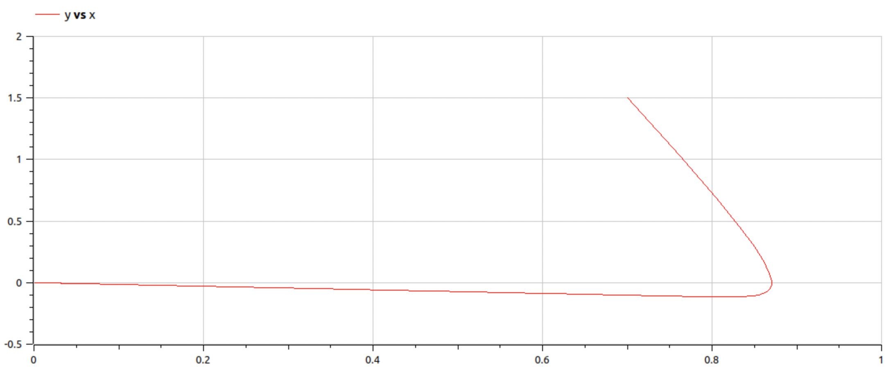{#fig:10 width=70%}

  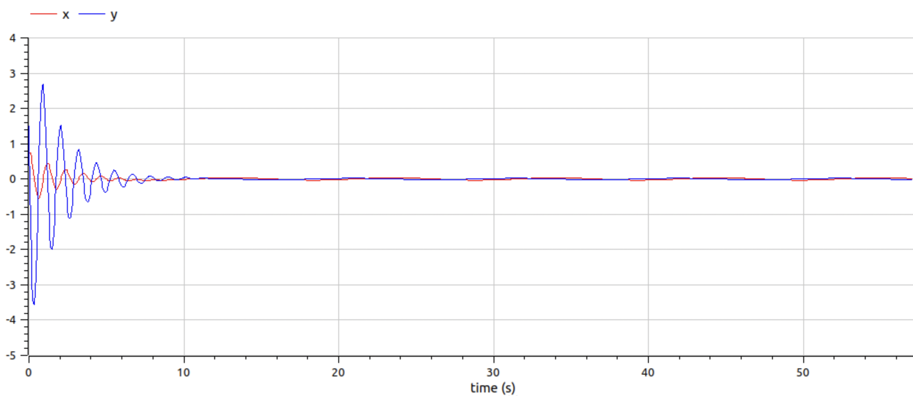{#fig:11 width=70%}

  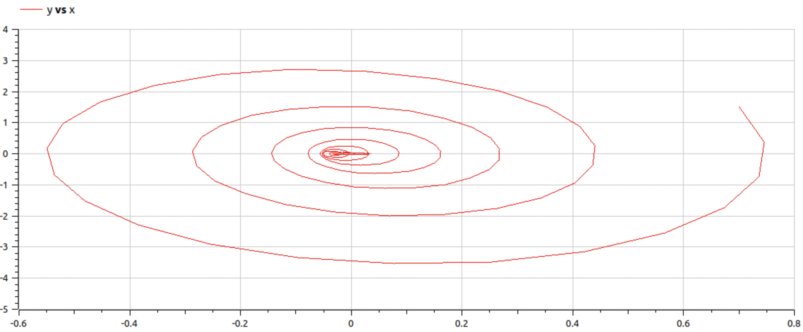{#fig:12 width=70%}

# Выводы

Успешно рассчитали модель линейного гармонического осциллятора

# Список литературы{.unnumbered}

::: {#refs}
:::
